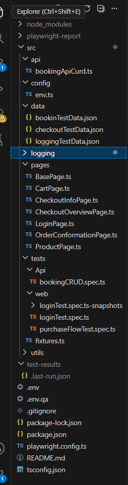
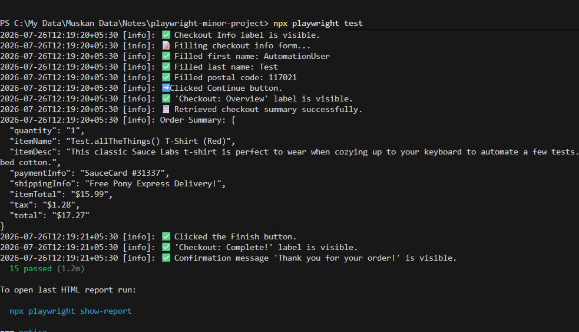
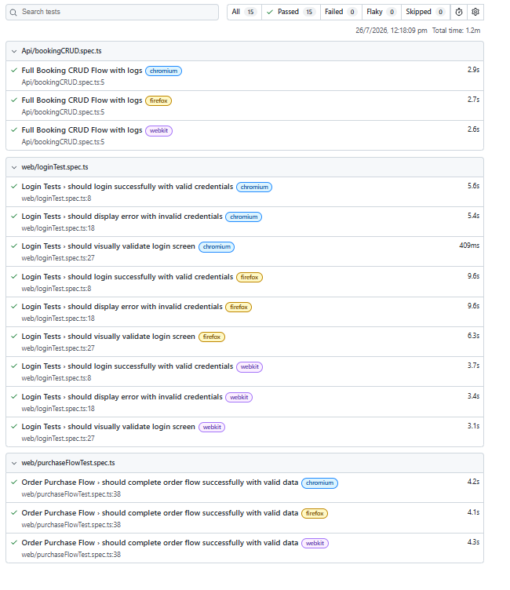

# Playwright Automation Framework

A scalable End-to-End Test Automation Framework built using Playwright and TypeScript.

This framework automates both Web UI and API testing using reusable components and follows the Page Object Model (POM) design pattern for better maintainability.

---

## Features

- End-to-End Web UI Automation
- API Testing
- Page Object Model (POM)
- Environment Configuration
- Test Data Management (JSON)
- Reusable Utility Functions
- Logging using Winston
- Cross Browser Support
- HTML Reporting
- Easy Test Execution

---

## Tech Stack

- Playwright
- TypeScript
- Node.js
- npm
- Winston Logger

---

## Framework Structur

```
src
│
├── api
│   └── bookingApiCrud.ts
│
├── config
│   └── env.ts
│
├── data
│   ├── bookingTestData.json
│   ├── checkoutTestData.json
│   └── loginTestData.json
│
├── logging
│
├── pages
│   ├── BasePage.ts
│   ├── LoginPage.ts
│   ├── ProductPage.ts
│   ├── CartPage.ts
│   ├── CheckoutInfoPage.ts
│   ├── CheckoutOverviewPage.ts
│   └── OrderConfirmationPage.ts
│
├── tests
│   ├── Api
│   └── Web
│
└── utils
```
### Project Structure



---

## Automated Test Scenarios

### Web Testing

- Login Validation
- Product Selection
- Add Product to Cart
- Cart Verification
- Checkout Process
- Order Confirmation

### API Testing

- Create Booking
- Get Booking
- Update Booking
- Delete Booking

---

## Design Pattern

This framework follows the Page Object Model (POM) design pattern.

Benefits:

- Reusable code
- Easy maintenance
- Better readability
- Separation of test logic and page elements

---

## Installation

Clone the repository

```bash
git clone https://github.com/muskansharmaQAAutomation/playwright-automation-framework.git
```

Install dependencies

```bash
npm install
```

Install Playwright browsers

```bash
npx playwright install
```

---

## Execute Tests

Run all tests

```bash
npx playwright test
```

Run Web Tests

```bash
npx playwright test src/tests/Web
```

Run API Tests

```bash
npx playwright test src/tests/Api
```

Run headed

```bash
npx playwright test --headed
```
### Test Execution Results



---

## Generate HTML Report

```bash
npx playwright show-report
```
### HTML Report



---

## Configuration

Environment variables are managed using `.env` files.

Example:

```
WEB_URL=https://www.saucedemo.com
API_URL=https://restful-booker.herokuapp.com
USERNAME=standard_user
PASSWORD=secert_sauce
```

---

## Future Improvements

- CI/CD using GitHub Actions
- Docker Support
- Parallel Execution
- Allure Reporting
- Visual Regression Testing

---

## Author

**Muskan Sharma**

Software Testing & QA


